# Merkle Ledger

A high-performance, append-only, tamper-evident cryptographic transaction log engine built on post-order flat-indexed Merkle Mountain Ranges (MMR). This repository provides a formal framework for data integrity, stateless auditability, and efficient historical verification.

## Overview

Merkle Mountain Ranges allow new transactional records to be appended sequentially without rebalancing or rewriting prior tree structures. The ledger is represented mathematically as a sequence of perfect binary subtrees, each covering a power-of-two range of leaves.

### Architectural Invariants

* **Amortized O(1) append performance:** New leaf nodes are committed directly to a flat-array layout, triggering cascading parent merges only when preceding peaks reach matching tree heights.
* **O(log n) inclusion proofs:** Clients can verify that a specific log entry exists inside the ledger at a declared index position using an ordered collection of sibling hashes.
* **O(log n) consistency proofs:** Auditors can verify that a newer state configuration is a pure, append-only continuation of a historical snapshot size, completely preventing retroactive history rewrites.
* **Strict immutability guarantee:** The underlying persistence engine enforces a write-once constraint per storage index to defend against tampering.

---

## Architecture & Data Flow

The ledger orchestrates interactions between the stateless network layer, the mathematical tree-traversal logic, and the immutable storage abstraction.

```mermaid
flowchart TD
    subgraph ClientSpace["Client Space"]
        Client["External Client / SDK"]
    end

    subgraph NetworkLayer["Network Layer (src/index.ts & src/server.ts)"]
        Router["HTTP Router & Request Worker"]
        Queue["FIFO Task Execution Queue"]
    end

    subgraph CoreEngine["Core Engine (src/mmr/)"]
        MMR["MMR Tree State Machine"]
        Math["Post-Order Traversal Math"]
    end

    subgraph CryptographicVerification["Cryptographic Verification (src/proofs/)"]
        Verifier["Stateless Proof Verifier"]
    end

    subgraph PersistenceLayer["Persistence Layer (src/storage/)"]
        Storage["DiskStorage / Segment Logs"]
    end

    Client -- "1. Post Payload" --> Router
    Router --> Queue
    Queue -- "2. Sequential Process" --> MMR
    MMR -- "3. Query Structural Math" --> Math
    MMR -- "4. Write Node/Index" --> Storage

    Client -- "5. Get Proof Request" --> Router
    Router --> MMR
    MMR -- "6. Fetch Chained Nodes" --> Storage
    MMR -- "7. Build Proof Payload" --> Router
    Router -- "8. Return Proof" --> Client
    Client -- "9. Verify Out-of-Band" --> Verifier

    style NetworkLayer fill:#112233,stroke:#334455,stroke-width:2px;
    style CoreEngine fill:#112F22,stroke:#225533,stroke-width:2px;
    style PersistenceLayer fill:#2D1919,stroke:#552222,stroke-width:2px;
```



## Repository Structure

```text
merkle-ledger/
├── .github/
│   └── workflows/
│       └── ci.yml                   # Continuous Integration pipeline
├── src/
│   ├── index.ts                    # Microservice initialization and port listener setup
│   ├── server.ts                   # Native HTTP request router and endpoint orchestration
│   ├── config/
│   │   └── options.ts              # Runtime database engine config options
│   ├── crypto/
│   │   └── verifier.ts             # Standalone mathematical proof verifier
│   ├── mmr/
│   │   ├── mmr.ts                  # Core tree mechanics, peak aggregation, and proof calculation
│   │   ├── batch.ts                # Transaction pipeline for atomic bulk insertions
│   │   └── math.ts                 # Flat post-order array index-traversal utilities
│   ├── proofs/
│   │   └── engine.ts               # Stateless verification logic for inclusion and consistency claims
│   ├── storage/
│   │   ├── diskStorage.ts          # Segmented flat file persistent logging manager
│   │   ├── pageCache.ts             # Byte-addressable binary mapping page cache
│   │   └── scavenger.ts            # Automated diagnostic background bit rot auditor
│   ├── types/
│   │   └── index.ts                # Shared operational interfaces and serialization contracts
│   └── test/
│       ├── ledger.test.ts          # Automated core regression test suite
│       └── integration.test.ts     # End-to-end multi-step system simulation tests
├── dist/                           # Compiled JavaScript distribution artifacts
├── package.json                    # Node.js project manifest and dependency graph
└── tsconfig.json                   # TypeScript compiler configurations
```

## Core API Specifications

The HTTP service exposes the following endpoints for ledger interaction and cryptographic validation.

### POST /api/append
Appends a new data payload to the transactional ledger log.

**Request body**
```json
{
  "payload": "string"
}
```

**Success response**
```json
HTTP/1.1 201 Created
{
  "success": true,
  "leafIndex": 42,
  "storageIndex": 79,
  "rootHash": "8f97...3a2b"
}
```

### GET /api/proof/inclusion/:leafIndex
Generates an inclusion proof verifying a leaf exists at a specific tracking coordinate.

**Success response**
```json
HTTP/1.1 200 OK
{
  "leafIndex": 42,
  "leafValue": "payload_string",
  "siblings": ["a1b2...", "c3d4..."],
  "peakHashes": ["e5f6...", "789a..."]
}
```

### GET /api/proof/consistency?oldSize=:oldSize&newSize=:newSize
Generates a consistency verification chain between two historical tree milestones.

**Success response**
```json
HTTP/1.1 200 OK
{
  "oldSize": 10,
  "newSize": 45,
  "proofHashes": ["b2c3...", "d4e5..."]
}
```

## Quickstart

### Prerequisites

* Node.js 22.x, 24.x, or 26.x
* npm 10.x or higher

### Installation

```bash
npm ci
```

### Common commands

```bash
npm run build
npm test
npm start
```

The service starts on `http://127.0.0.1:8080` by default.

## Verification Mathematics

This project uses a 0-based, flat post-order binary numbering convention. Node heights are calculated implicitly from node positions within the sequence.

For a storage index `x`, the peak height is derived from the node's positional structure:

```text
height(x) = evaluateNodeHeight(x)
```

Parent and sibling relationships follow append-only invariants:

* Left child: `x - 2^{height(x) + 1} + 1`
* Right child: `x - 1`

This convention guarantees that each perfect binary peak tree segment remains independent and immutable once it reaches full capacity.
